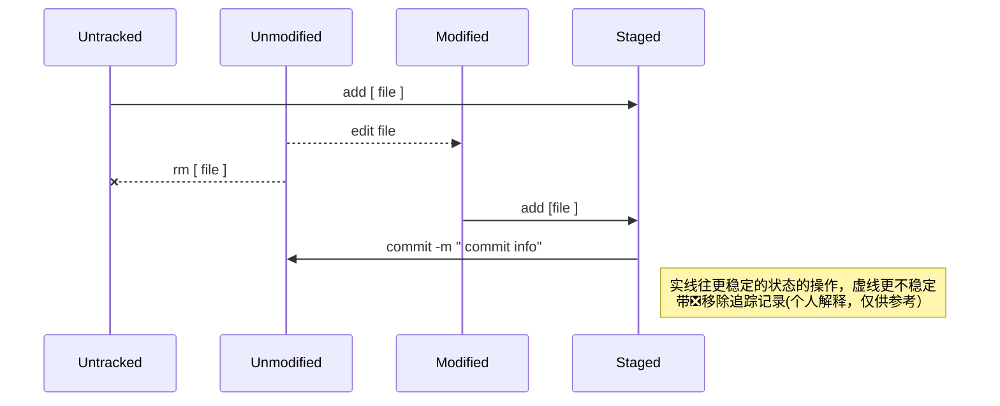
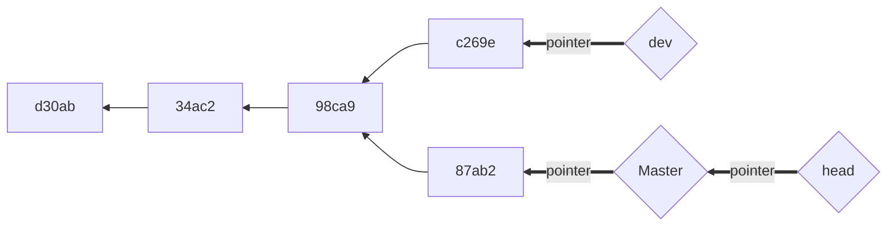
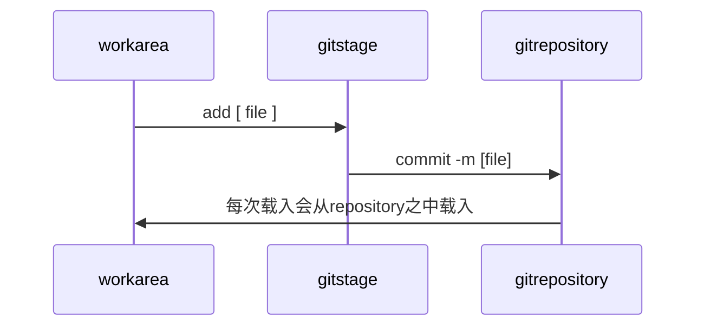

## start  
   * git init  
          创建一个仓库  

## file_base_command
   * git add  
        * 1.添加一个文件成索引状态  
        * 2.把修改过的文件提交到暂存区
   * git rm  
        * 移除一个文件的索引状态
   * git diff  
        * 比较源文件 和目标文件的修改
   * git log  
        *  显示提交状态 方式较多，format可以定制
   * git commit  
        *  把暂存区的文件提交到git仓库里面
        *  m选项添加message
        * amend 选项修复上一次的提交

### file status
  
| 索引态(traked)      | -                  |
|---------------------|--------------------|
|                     | 修改态(Modified)   |
|                     | 暂存态(Staged)     |
|                     | 提交态(Unmodified) |
| 未索引态(Untracked) |                    |  

文件仓库中的文件有索引和未索引之分（也就是是否被git追踪修改）  

  
**文件之间的状态变化及操作** 

## branch(git 杀手锏）
   * git branch
        *  后面跟分支名 新增一个分支（其实是添加一个指针） 
   * git checkout
   * git checkout -b
        *  切换到一个分支里面区 b选项可以新建一个分支
   * git merge
        *  合并两个分支

**假设有两个分支Master ,dev,其余的为一次次的提交（镜像）.那么分支树大概如下**   
**每个分支有不同的指针指向，HEAD指针指向当前分支的指针** 

### git目录下的结构
├── .git  
│   ├── HEAD  
│   ├── branches  
│   ├── config  
│   ├── description  
│   ├── hooks  
│   ├── info  
│   ├── objects  
│   └── refs  
└── readme  
work area :当前目录  
git repository :.git目录=仓库  
git stage : 暂存  

