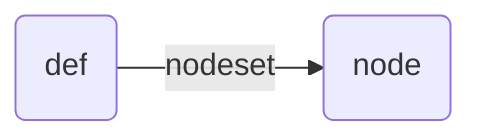

# xcat  
> 集群硬件管理和部署


## xcat

```bash
xcatprobe xcatmn #check if xcat has been installed correctly(确认xcat环境)

# 创建一个定义文件，节点类型 以g01n01为模板，mac地址和bmc和ip不一样
mkdef -t node -o g01n02 --template g01n01 mac=B4:05:5D:AA:34:C8 ip=172.19.1.2 bmc=192.168.62.202
chdef g01n02 mac=b4:5d ip=172.19.1.2 bmc=192.168.62.202 # 更改特定参数
chdef g01n02 nicips.ib0=172.20.1.2
chdef g01n02 --template g01n01 mac=b4:5d ip=172.19.1.2 bmc=192.168.62.202 #改变对象的某个参数值
# 查看定义文件
lsdef #列出对象
lsdef g01n02 #列出特定对象
# 重启安装
nodeset g01n02 osimage=centos7.8 #指定对象的系统镜像、重启之后重装
rsetboot g01n02 net #reboot g01n02 configure
rpower g01n02 status

# xcat数据库查看
tabdump osimage
tabdump networks
# 修改xcat数据库内容（操作前注意备份）
# 例1：修改xcatdefaults属性
tabdump postscripts
tabedit postscripts -w "node=xcatdefaults"  # 删除掉不想要的部分 node后面更列表名

# 单个节点更新单个脚本  
updatenode node01 -P script1

```
