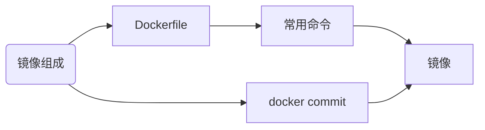

## 镜像组成（镜像层+容器层）
* 内核共用host的内核（eg. uname -r容器内外一样）
* 镜像层可读、不可修改，且叠加只出现第一次出现的内容
* 容器层可写
* base镜像（一般是环境）：不依赖其他镜像，从scratch开始；其他镜像从基础镜像扩展出

## 镜像制作
### 1.docker commit
```	bash
docker run -it centos
yum install -y vim  #（执行前需要配置repo库，不然会使用默认的）
#另一个终端
docker commit  [name0]  [name1]
```
两个镜像都会存在。
### 2.Dockerfile
最小的镜像的Dockerfile
```bash
FROM  scratch
ADD hello  /
CMD ["/hello"]
#终端
docker build -t [name]  #  t 指定名字
```
Dockerfile不产生中间镜像
 等同于上面的docker commit
 ```bash
 FROM centos
 RUN  yum makecache && yum install -y vim
 ```
 3.Dockerfile 常用指令
 FROM :指定base镜像
 MAITAINER：指定作者名
 COPY：复制到镜像
 ADD：复制到镜像，如果是压缩包等，自动解压。
 ENV:添加环境变量
 EXPOSE ：指定容器监听一个端口
 VOLUME：将文件或目录声明成volume，做容器储存使用
 RUN：在容器中运行指定命令（执行command并常生镜像，常用作安装软件）
CMD：启动容器运行指令
ENTRYPOINT：容器启动里面运行命令（与cmd区别）
WORKDIR：指定目录

