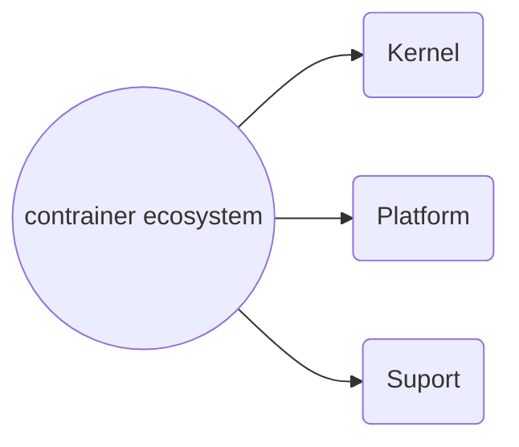
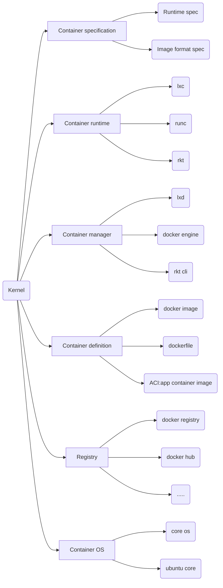
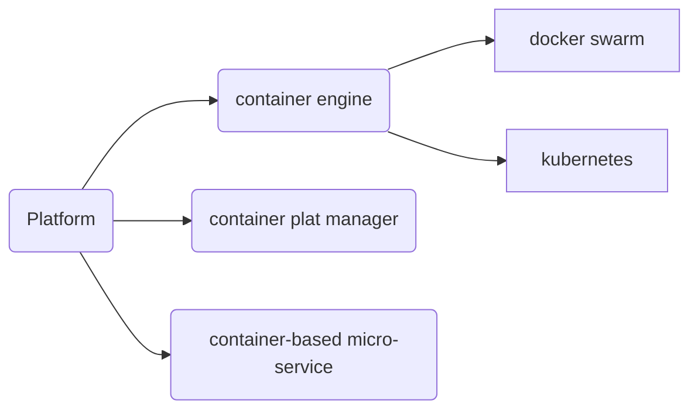
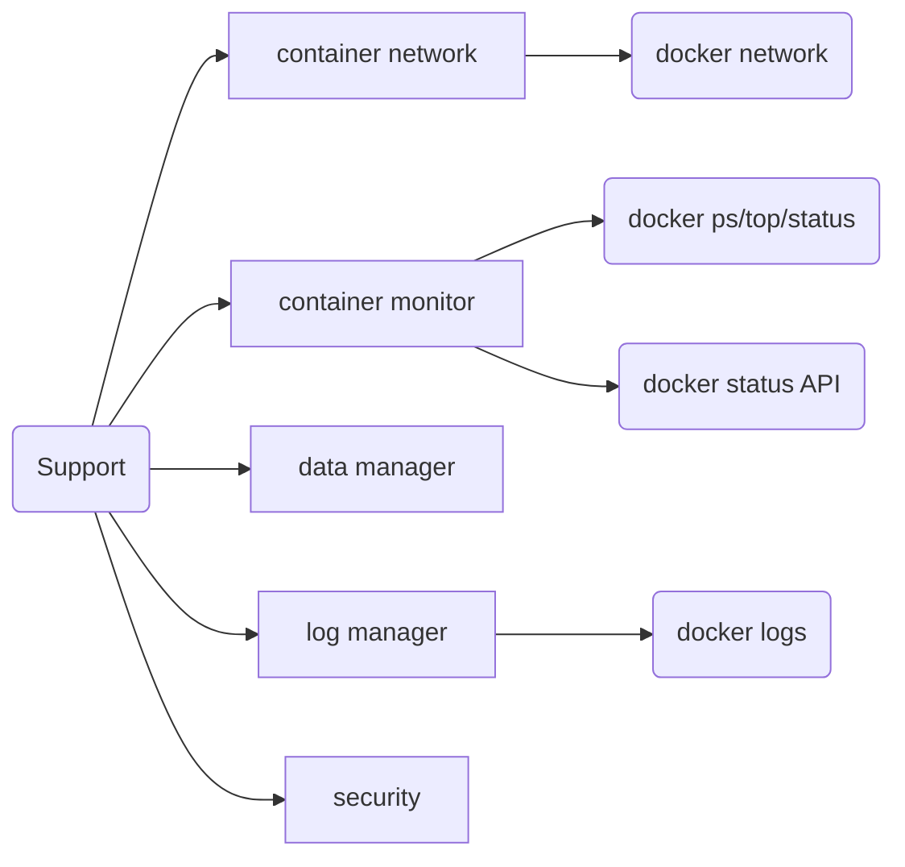

# container ecosystem
容器生态系统，思维导图
自己的小理解，仅作为捋思路使用。

## 容器技术的背景、基础结构

容器生态主要分为三块大的组成，核心技术、平台、支持技术

### 核心技术==为了一个大目标：应用环境的更广、更适用==
 - specification：标准是基础，统一容器的标准，好似usb接口取代了许多电脑接口，来源于标准化，主要使runtime和image进行标准化。
* runtime：容器运行的环境。
lxd：原docker默认的runtime，来源于Linux。
runc：docker自己开发的runtime，先docker默认。
* manger:容器的管理器，lxd是lxc的。
   docker engine：通常所说的docker所指，主要包括daemon（服务器）、cli（客户端）
 * registry ：镜像库，默认是docker hub，国内个人推荐daocloud。
 * container OS：专门为运行镜像而做的系统。

这是一个群体社会，==计算机也需要集群管理==
* platform：容器管理平台
container engine：容器编排引擎，最常用的是kubernetes（最火的）
  docker swarm（docker自己做的）
 * container-based micro-service:基于容器的微服务。
  

一个群体的运作离不开许多人在背后默默的支持， 容器的运行离不开许多的支持技术。

* network :docker network 是docker原生的解决网络的方案，常见的还有flanel、weave等
* container monitor：容器状态监控，常见的可用docker ps直接查看容器的运行信息。
* log manager：排除故障的查看之处，常见命令是docker logs

