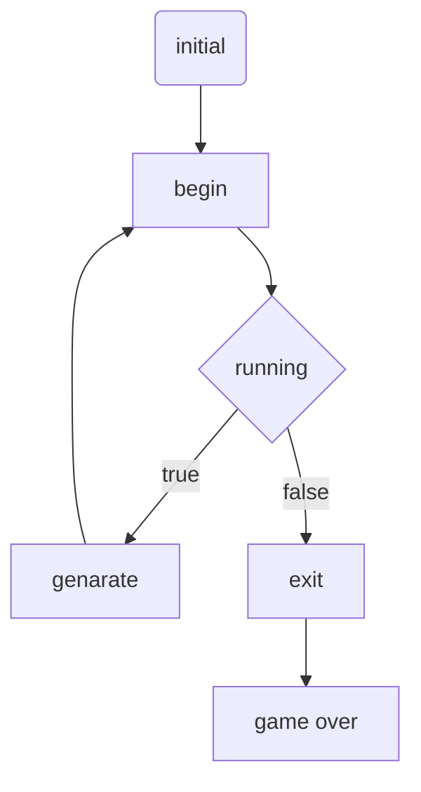

* content
{:toc}
> 程序=数据➕过程  

## 游戏分析

## 数据
- 创建数据
    - 操作空间 (int data[] [] )
    - 显示矩阵 (JTextArea[] [] grids )
    - 方块类型（int [] Rect)
    - 坐标（x，y）
 - 操作数据
    - 修改data值
    - 修改grids值
    - 获取Rect值
    - 修改/获取 x，y值
    - 修改/获取 running值
- 显示数据
    - 更新JTextArea [] []的状态值）
    - 游戏状态（boolean running）

```bash
 class
    WindowMatrix

 field
    grids [WindowMatrix]
    data [WindowMatrix]
    allRect [WindowMatrix]
    rect [WindowMatrix]
    x [WindowMatrix]
    y [WindowMatrix]
    running [WindowMatrix]
 method
    WindowMatrix [WindowMatrix]
    init [WindowMatrix]
    begin_game [WindowMatrix]
    ranRect [WindowMatrix]
    start [WindowMatrix]
    canFall [WindowMatrix]
    saveData [WindowMatrix]
    removeRow [WindowMatrix]
    reflesh [WindowMatrix]
    fall [WindowMatrix]
    clear [WindowMatrix]
    draw [WindowMatrix]
    keyPressed [WindowMatrix]
    keyReleased [WindowMatrix]
    keyTyped [WindowMatrix]
```
## 过程
- 基本操作
    - 上
    - 下
    - 左
    - 右
- 特殊过程
    - 遇到块
    - 消除块
    - 结束条件
### 流程图



**bala bala～～～～～**

**枯燥万千，我想说两个开发中遇到的妙事**
## 一些思考 （2个）
### 1界面布局 
- 终端
    - 不喜做UI最大的是适配问题
  

> 最好的适配是不要适配,选择终端  

- 字符界面  
    - 遇到了问题
    - 1.清屏问题《1通过疯狂跨行输出,2,才知道不同代码之间有其他的代码的接口，可以通过调用c来实现清屏
    - 3.字符获取问题。  
  
- GUI界面(改变思路)  
  
- GUI界面(改变思路)
    - 界面布局(主角登场）
        - 由绝对布局过渡到相对布局，这绝对是个跨时代的东西  
        **VB /matlab gui里面用到的布局都是绝对指定的通过（x,y,height,wight)决定**  
        **1，机型适配问题。-增加了极大不必要的时间。2，让人更加专注与产品本身）**  
  
        **解决方案1.相对像素。2，相对布局**  
        - 容器嵌套，由个别几个的嵌套（window，pannel）升级到所有对象都是容器
        **服务了上面的相对布局 也保持了整体布局的完整性和美观性**  

### 2形状的存储 

> 最大的问题：如何保存方块的形状◻️◼️  

- 两条路：1，存点的信息。2存点的形状
    - 用数组记录每个点的相对位置rect[19*4] [2]
```java
int allRect[19][2];
```
    - 对象继承，重新创建对象，（包含四个点)
    - 问题 1，内存耗费大。2，操作不方便，（public直接操作容易混淆，写接口需要改写的代码太大）
- 存点的形状
    - 选对数据结构（借鉴了网上的使用16位（4×4）来存形状）拍案叫绝
```java
allRect = new int[]{0x00cc, 0x8888, 0x000f, 0x0c44, 0x002e, 0x088c, 0x00e8, 0x0c88, 0x00e2, 0x044c, 0x008e, 0x08c4, 0x006c, 0x04c8, 0x00c6, 0x08c8, 0x004e, 0x04c4, 0x00e4};
```

  

- 想起了单片机开发，控制led灯的时候（通过7位）来控制每一个io接口。
  

> 视角越大，行之远  
> 视角越小，行之稳  
> 就好似有人追求大量数据训练拟合出概率（神经网络）  
> 有人追求方寸之地更好优化（单片机，系统优化）  
> 像是两个极端，看似不可相容，实则各有各的精彩  

