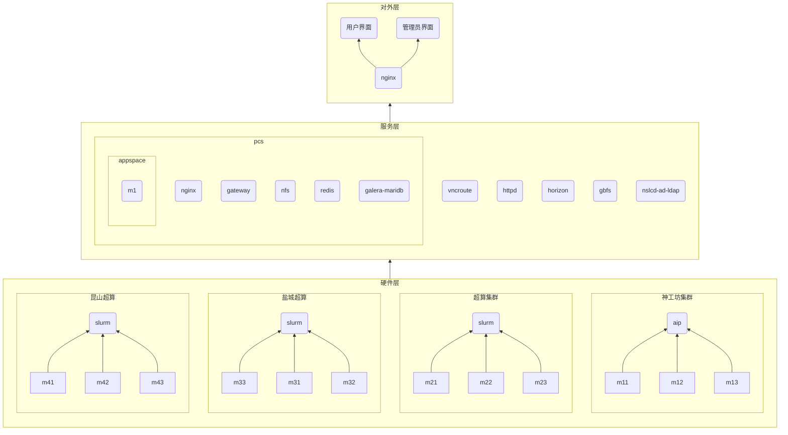

```mermaid
flowchart BT
subgraph level3[对外层]
    direction BT
    n1(nginx) --> out1(用户界面)
    n1 --> out2(管理员界面) 
end
subgraph level2[服务层]
    direction BT
        subgraph subLevel1[pcs]
        direction BT
            subgraph subSever[appspace]
            direction BT
            s1(m1) 
        end
        s2(nginx)  
        s3(gateway) 
        s4(nfs) 
        s5(redis) 
        s21(galera-maridb) 
    end
    s14(vncroute) 
    s15(httpd) 
    s16(horizon) 
    s17(gbfs) 
    s19(nslcd-ad-ldap) 
end
subgraph level1[硬件层]
    direction BT
    subgraph cluster1[神工坊集群]
    direction BT
        m11 --> c1(aip)
        m12 --> c1
        m13 --> c1
    end
    subgraph cluster2[超算集群]
    direction BT
        m21 --> c2(slurm)
        m22 --> c2
        m23 --> c2
    end
    subgraph cluster3[盐城超算]
    direction BT
        m33 --> c3(slurm)
        m31 --> c3
        m32 --> c3
    end
    subgraph cluster4[昆山超算]
    direction BT
        m41 --> c4(slurm)
        m42 --> c4
        m43 --> c4
    end
end
level1-->level2
level2-->level3
```