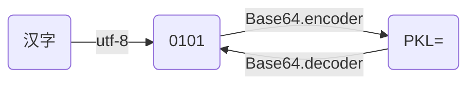

# base64 

## defination
- Unicode
    - 文件编码，支持全世界的文字。常用2-4个字节表示一个字符
- UTF-8 （Unicode Transformation Format)
    - 文件编码，为了节约存储空间和便于传输，将Unicode编码转化为可变长(1-6)的UTF-8编码，常用的英文字母被编编译成一个字节、汉字通常是3个字节，生僻字符为4-6个字节。
- base64
    - 二进制编码，使用字符串来代替二进制。Base64常用于表示、传输、存储二进制数据

